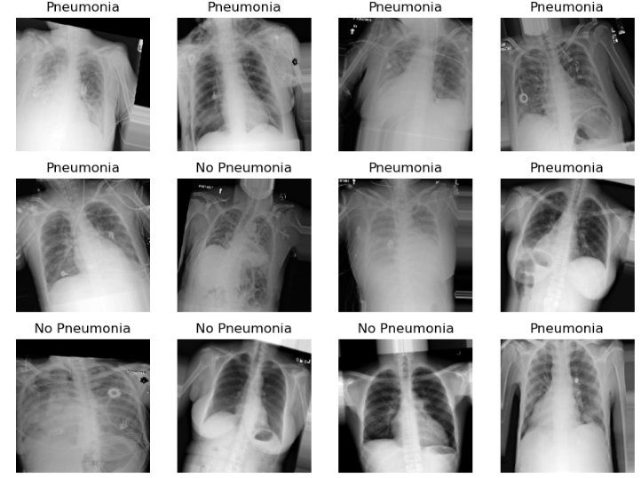
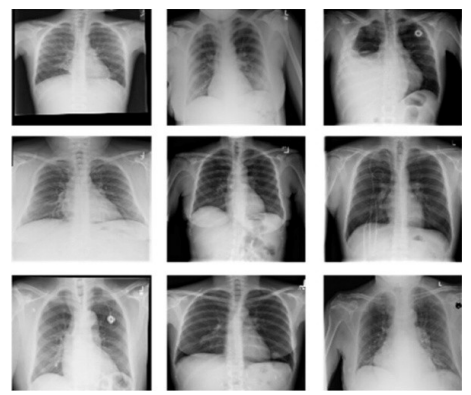

# Deep-Learning-for-pneumonia-detection-in-chest-x-rays

<p align="center">
  
</p>

This project presents a deep learning-based solution for **pneumonia detection** using **chest X-ray images**. Leveraging **transfer learning** with the pre-trained **VGG16** architecture, the model classifies X-rays as **Pneumonia** or **Normal**, aiming to assist radiologists with early and accurate diagnoses.

## 🚀 Features

- 🧠 **Deep Learning-Based Detection**  
  Designed a binary classifier to detect **Pneumonia** vs. **Normal** cases using chest X-ray images.

- 🏗️ **VGG16 Backbone**  
  Leveraged the pre-trained **VGG16** model for feature extraction through **transfer learning**.

- 🧪 **Robust Data Augmentation**  
  Enhanced model generalization using transformations such as **rotation**, **horizontal flipping**, and **zoom**.

- 🧬 **Custom Dense Head**  
  Added a fully connected classifier with **ReLU** and **Sigmoid** activations for final predictions.

- ⚙️ **Efficient Training Pipeline**  
  Trained using **Binary Cross-Entropy loss** and **Adam optimizer**.

- 🏆 **Model Benchmarking**  
  Compared performance against **ResNet50** and **EfficientNetB0**, with **VGG16** outperforming both.


## 🗂️ Dataset

<p align="center">
  
</p>

- **NIH ChestX-ray8 Dataset**
- Chest X-ray images resized to **224×224×3**
- Grayscale X-rays converted to RGB to match **VGG16** input requirements

## 🧱 Model Architecture

<div align="center">

<pre>
Input (224×224×3) 
   ↓
VGG16 (pre-trained convolutional base)
   ↓
Flatten
   ↓
Dense(128, ReLU) + Dropout
   ↓
Dense(1, Sigmoid) → Output (Pneumonia / Normal)
</pre>

</div>


## ⚙️ Installation

1. Clone the repository:
 ```bash
 git clone https://github.com/your-username/Deep-Learning-for-pneumonia-detection-in-chest-x-rays.git
 cd Deep-Learning-for-pneumonia-detection-in-chest-x-rays
